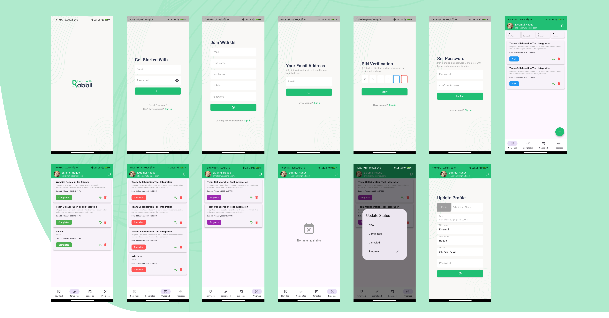

# Chat Rooms

A Native Android chat application built with Kotlin & Jectpack Compose, allowing users to create and join chat rooms for real-time, multi-user communication. Implemented with Firebase as the backend database, with user authentication handled via Firebase Authentication, and structured with MVVM architecture for efficient data handling and maintainability.

## Screenshots

## Features

- Android/IOS support
- Easily Scalable and maintainable
- Attractive UI
- Token Verification
- Rest API Integration

## 🛠️ Technologies Used

   

## 🤝 Contributions
Feel free to fork this repository, make changes, and submit a pull request. Contributions are always welcome!

---

## 📫 Contact
**Ekramul Haque**
- 📧 Email: [ehr.ekramul@gmail.com](mailto:ehr.ekramul@gmail.com)

---

## 🌐 Connect with me

---

## ⭐ Support This Project

If you find this repository helpful, consider supporting it by:
- 🌟 Starring the repository
- 🍴 Forking it to explore and improve
- 📣 Sharing it with others

---

## 📜 License
This project is licensed under the **MIT License**. Feel free to use and modify the code.

---

# **🎉 Happy Coding! 🎉**

